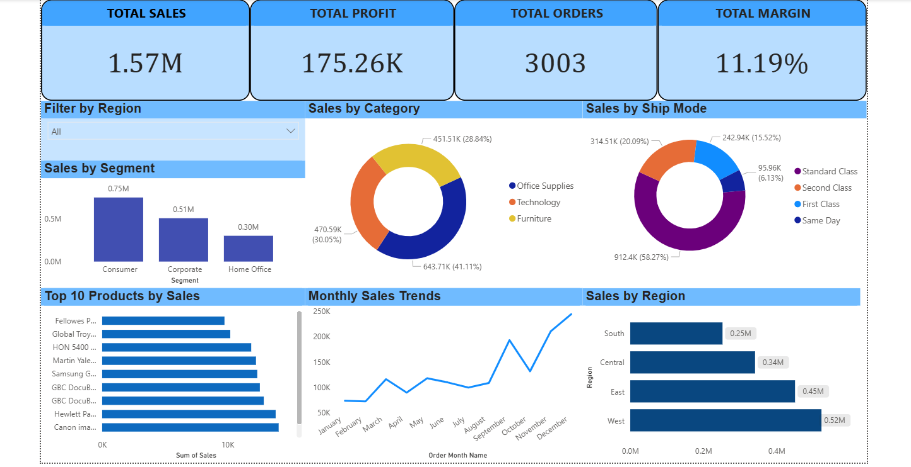
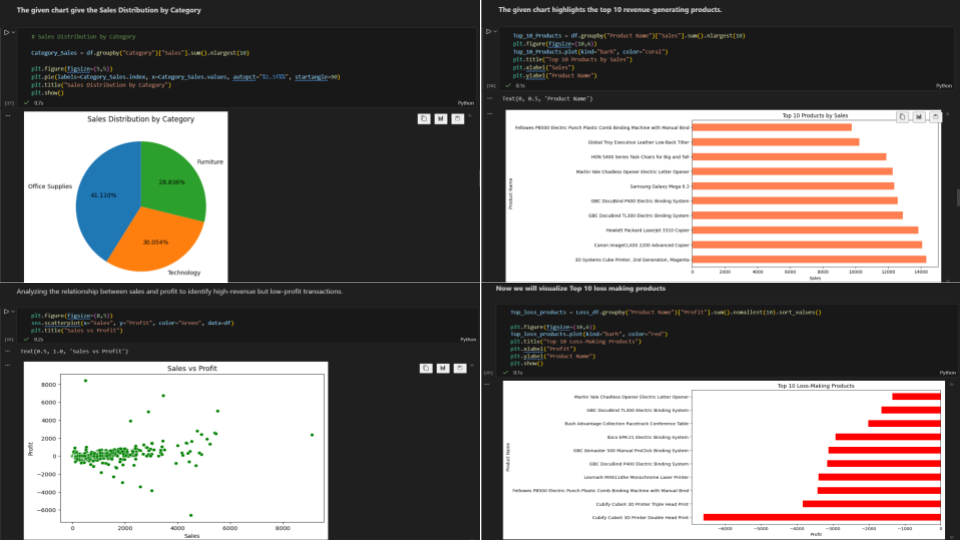

# 📊 Sales Performance Analysis Dashboard

## 🔹 Project Overview
This project analyzes sales performance using **Python and Power BI** to uncover business insights and trends.

---

## 🛠 Tools & Technologies
- Python (Pandas, Matplotlib, Seaborn)
- Power BI
- Excel

---

## 📂 Dataset
Superstore sales dataset including:
- Orders
- Sales
- Profit
- Region
- Category
- Ship Mode

---

## 📈 Python Analysis
- Data cleaning & preprocessing
- Sales by Region
- Sales by Segment
- Top 10 products by Sales
- Monthly Sales Trend

---

## 📊 Power BI Dashboard Features
- KPI Cards → Total Sales, Profit, Orders, Margin
- Sales by Region
- Sales by Category
- Sales by Ship Mode
- Monthly Sales Trend
- Interactive slicer (Region filter)

---

## 📷 Dashboard Preview

## 📷 Python Visuals

---

## 💡 Key Insights
- West region has highest sales
- Technology category generates highest revenue
- Consumer segment contributes the most sales
- Sales peak in November–December

---

## 👨‍💻 Author
Aryan Solanki
